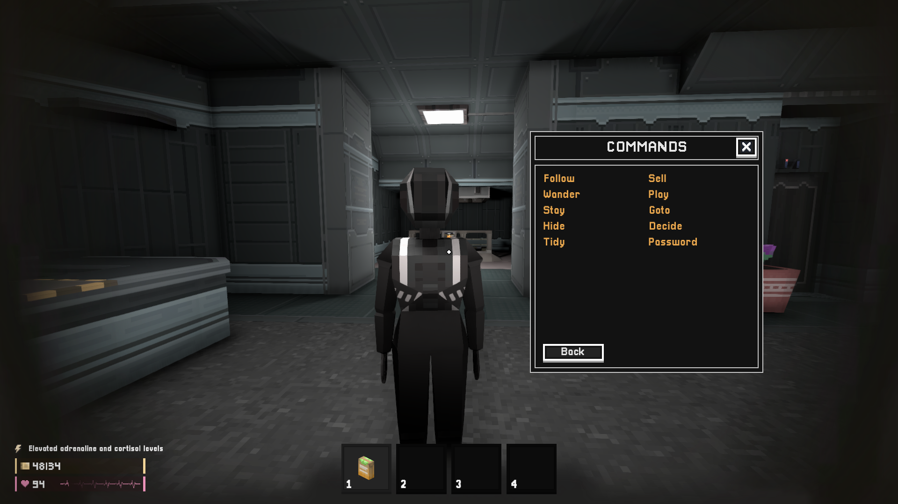
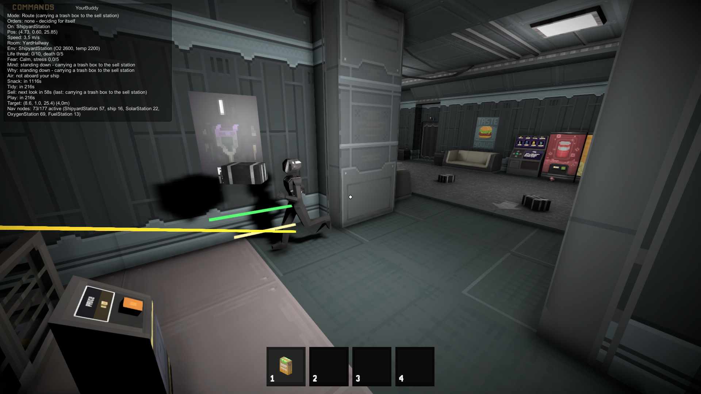
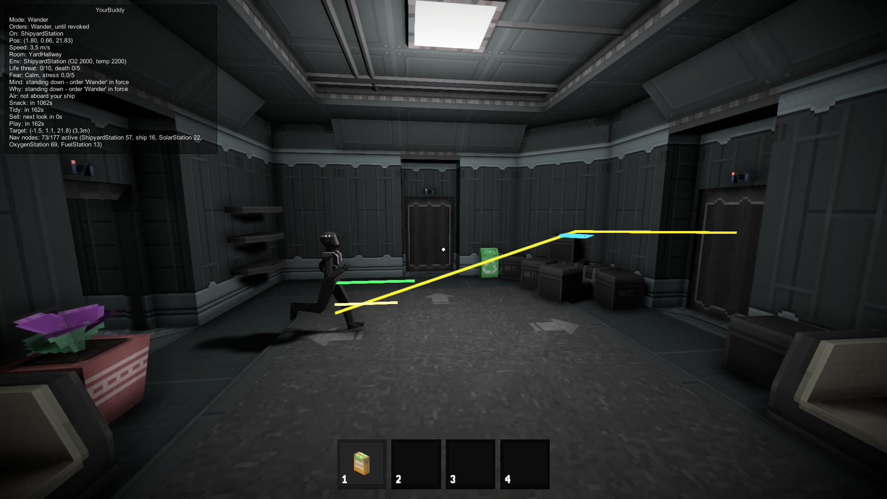
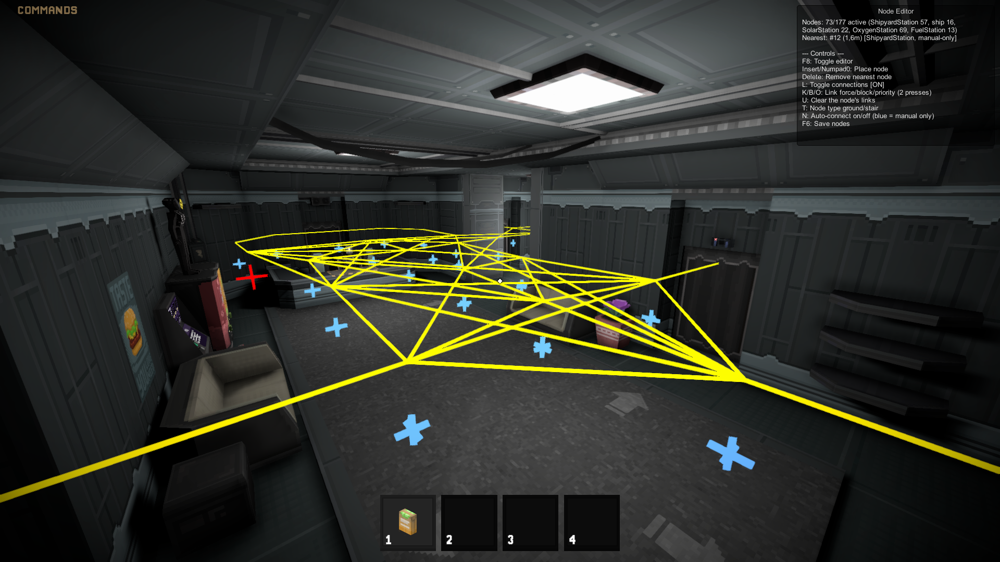

# YourBuddy Mod

A BepInEx 5 plugin that adds a player-like NPC companion to Isolated Inhale.

It was primarily created as a fun alternative to multiplayer, as the game's creator has no plans to add it anytime soon.

In theory, the mod should reduce anxiety; in practice, after playing alone for a long time, having someone constantly nearby is a bit unnerving. Anyway, try it yourself.

> ⚠️ **Disclaimer**: This mod may break immersion, the game is single‑player by design. Use after finishing the storyline for best experience.

---

## Features

**The buddy**
- A companion NPC that uses the player's model.
- A new game starts with it asleep in the cryo capsule next to yours; it wakes shortly after you step out. In an existing save, `spawn_buddy` brings one in - or several: `spawn_buddy 3`.
- Can be killed by deadly atmospheres or the Breathless, and becomes a ragdoll you can pick up and carry with the Grab key.

**Orders**
- Look at it and press Interact to open an order window: follow, wander, stay, walk to a node, hide, tidy up, sell, play, or decide for itself. Wording is matched loosely.
- Give it door PIN codes; it uses each one only on the keypad it belongs to.
- Orders hold until you revoke them, or expire after a while if you prefer.

**Its own mind**
- With no order in force, it **weighs** what is worth doing - how long since it last did it, how much there is to do, how far away - and picks between the best few at random, so it never runs the same routine twice.
- Switches the oxygen generator or climate control back on when the air turns dangerous and the unit is off. It never switches anything off or clears a fault.
- Now and then eats or drinks something nearby, from a fridge, cabinet, chest or locker (closing it again) or off the floor. It leaves the food alone while you are hungry.
- Tidies up: collects several pieces of rubbish in a row, loose or out of a cupboard, and takes them to a trash can.
- Carries every trash box it can find to a sell station and sells the lot in one press - the money is yours.
- Messes about with loose objects when bored: carries one across the room or into the next, or throws it about and fetches it.

**Fear**
- Reacts to the Breathless: watches it, refuses to walk toward it, and when it has stared too long or the monster comes too close, either **runs** - first away, then to you - or **hides** in a closet or locker until the monster is gone.

**Navigation**
- Ships with a ready-made nav graph for the ship and every station.
- Opens room doors in its path and routes around the ones it cannot open; stays out of airlocks and open space.
- Build or adjust your own graph with the in-game node editor, automatically or by hand.

**Saves and tools**
- Its state is saved in a `.buddy` sidecar file next to your save, so removing the mod leaves your save untouched.
- Console commands for full control, an on-screen HUD, debug visuals and adjustable log verbosity.

---

## Installation

1. Install **[BepInEx 5](https://github.com/BepInEx/BepInEx/releases)** for Isolated Inhale - the Windows x64 build (`BepInEx_win_x64_5.x.x.zip`), extracted into the game folder next to `Isolated Inhale.exe`.
2. Download the latest `YourBuddy.dll` from the [Releases](https://github.com/bytenull1/yourbuddy-inhl/releases) page, and
   `NPC.Core.dll` from [NPC.Core's releases](https://github.com/bytenull1/npc-core-inhl/releases) - the shared NPC library the buddy walks with.
3. Place both `.dll` files into `BepInEx/plugins/`.
4. Launch the game. The mod will create a configuration file at `BepInEx/config/com.bytenull1.yourbuddy.cfg`.

> For debugging, you can enable the console in `BepInEx/config/BepInEx.cfg`, the `[Logging.Console]` block is responsible for this, change the value of the parameter `Enabled = false` to `Enabled = true`

---

## Building from Source

The project is an SDK-style class library targeting **.NET Standard 2.1**, so no Visual Studio project system or `.NET Framework` targeting pack is required - the .NET SDK is enough to build it.

1. **Install required tools**
   - [.NET SDK](https://dotnet.microsoft.com/en-us/download) (a recent version)
   - Optional: **Visual Studio**, **Rider**, or **Visual Studio Code** with the C# extension.

2. **Clone the repository** (or extract the source archive).

3. **Provide the reference assemblies**
   Copy the DLLs the project compiles against out of your own game install into
   `YourBuddy/lib/`. The list and where each one comes from is in
   [`YourBuddy/lib/README.md`](YourBuddy/lib/README.md). They are not redistributed
   here and are not copied into the build output.
   YourBuddy builds on [NPC.Core](https://github.com/bytenull1/npc-core-inhl): clone it beside this repository
   (`../npc-core-inhl`) and it is built with YourBuddy, or copy its `NPC.Core.dll` into `YourBuddy/lib/`.

4. **Build the project**
   - From the command line, in the repository root: `dotnet build YourBuddy/YourBuddy.csproj -c Release`
   - In Visual Studio / Rider: open `YourBuddy.slnx` and build the `Release` configuration.
   - There is no framework/toolset mismatch to worry about - `netstandard2.1` builds the same way on any platform with the .NET SDK installed.

5. **Output file**
   After a successful build, `YourBuddy.dll` will appear in `YourBuddy/bin/Release/netstandard2.1/`. Copy it to `BepInEx/plugins/` in your game directory, together with `NPC.Core.dll`, and launch the game.

---

## Configuration

General settings (section `General`). The debug level, the bundled nav graph and the node editor keys are NPC.Core's, in `com.bytenull1.npccore.cfg` ([its README](https://github.com/bytenull1/npc-core-inhl#configuration)); a first start copies over what you had set here.

Show all settings

| Setting | Section | Default | Description |
|-----------------------|-----------|---------|-------------|
| `SaveSupport` | General | `true` | Writes/reads the buddy's location to a sidecar `.buddy` file next to your save. |
| `SpawnOnNewGame` | General | `true` | A new game starts with a buddy: it sleeps in a cryo capsule next to yours and wakes after you step out, or stands in the Shipyard's hallway if no capsule can be opened. |
| `WakeAfterPodOpenSeconds` | General | `10` | How long that buddy keeps sleeping after your own pod starts opening. |
| `MortalNPC` | General | `true` | Allows the buddy to die (ragdoll) from deadly conditions. |
| `PreventSpace` | General | `true` | Prevents the buddy from opening airlocks, walking into open space, and teleports it back inside if it ends up there anyway. |
| `AutoDoors` | General | `true` | Allows the buddy to open room doors (Gate type) in front of it. |
| `Dialog` | General | `true` | Look at the buddy and press Interact to open the order window (follow, do its own thing, stay, hide, tidy up, sell, play, get a snack, walk to a node, give it a door password). |
| `Fear` | General | `true` | The buddy reacts to the Breathless: watches it, keeps away from it, runs from it or hides. Off: it ignores the monster (which can still kill it). |
| `HideInClosets` | General | `true` | A frightened buddy may get into a closet or locker instead of running, shut the doors, and wait there until the Breathless is no longer about. It never uses one you are in. |
| `FleeHideBias` | General | `0.5` | How readily it hides rather than runs: `0` never, `1` always try. The chance drops while the Breathless can see it - it would watch the buddy climb in - or is too close to beat to the doors, and rises when there is nowhere to run to. |
| `Autonomy` | General | `true` | The buddy decides for itself whenever no order is in force. Off: it only ever does what it was last told. Also `buddy_auto`. |
| `OrderPersistence` | General | `UntilRevoked` | `UntilRevoked`: an order holds until you give another one or tell it to decide for itself. `Expires`: it decides for itself again after `OrderExpirySeconds`. A goto always runs to completion. |
| `OrderExpirySeconds` | General | `90` | How long an order holds under `Expires`. |
| `Terminals` | General | `true` | When oxygen runs low or it gets too cold or hot aboard and the oxygen generator or climate control is off, a buddy deciding for itself walks over and switches it on. |
| `Snacks` | General | `true` | Now and then a buddy deciding for itself eats or drinks something nearby: from a container with food in it, or lying about. Never while you are hungry. `buddy_snack` triggers one now. |
| `SnackIntervalMinutes` | General | `13` | Roughly how many minutes pass between snacks (25% more or less each time) - tracks how often the player's own satiety needs topping up. |
| `Tidying` | General | `true` | Now and then a buddy deciding for itself clears the rubbish: two to five pieces in a row, loose or out of a cupboard it closes again, into a trash can. `buddy_tidy` starts a round now. |
| `TidyIntervalMinutes` | General | `5` | Roughly how many minutes pass between tidying rounds (25% more or less each time). |
| `SellTrash` | General | `true` | When trash boxes have piled up and a sell station is in reach, the buddy carries every one it can to the station, loads them and presses the button once - the money is yours. It only presses when nothing else sellable is in there and nobody is standing inside. `buddy_sell` starts a run now. |
| `ItemPlay` | General | `true` | Now and then, with nothing better to do, the buddy plays with something loose: carries it across the room, takes it into another room, or throws it about and fetches it back. One to three games in a row. `buddy_play` starts a session now. |
| `ItemPlayAnything` | General | `false` | What it may play with. Off: rubbish only. On: any loose object, your tools, food and cells included, which it will throw about like anything else. |
| `ItemPlayIntervalMinutes` | General | `5` | Roughly how many minutes pass between play sessions (25% more or less each time). |
| `DebugVisuals` | General | `false` | Draws navigation probes, target markers, and path lines. |
| `ShowHud` | General | `false` | Displays an on‑screen status panel (mode, orders, position, room, environment, fear, mind, errand timers, target); hidden while the console is open. |
| `MoveSpeed` | General | `3.5` | Default movement speed in m/s. |

You can change these values in the config file or via console commands (see below).

---

## Console Commands Reference

Show all console commands

| Command | Arguments | Description |
|---------|-----------|-------------|
| `spawn_buddy` | `[number]` | Replaces every buddy with one in front of you, or with that many in a row. |
| `buddy_list` | – | Lists the buddies with their numbers and names; `*` marks the one commands go to. |
| `buddy_despawn` | `[@who]` | Despawns a buddy. |
| `kill_buddy` | `[force] [@who]` | Kills a buddy (ragdoll), with an optional forward impulse force (0–100). |
| `buddy_follow` | `[@who]` | Switch to follow mode. |
| `buddy_wander` | `[@who]` | Switch to wander mode (uses nav nodes as points of interest). |
| `buddy_stay` | `[@who]` | Hold position until told otherwise. |
| `buddy_stop` | `[@who]` | Stop current route/wander and follow. |
| `buddy_goto` | `<node_index> [@who]` | Walk the buddy to a specific nav-graph node (the dialog takes room names instead). |
| `buddy_snack` | `[@who]` | Make the buddy get a snack nearby right now (ignores the schedule and the `Snacks` setting). |
| `buddy_tidy` | `[@who]` | Make it clear the rubbish nearby into a trash can right now, several pieces in a row. |
| `buddy_sell` | `[@who]` | Make it take every trash box nearby to a sell station and sell them in one press. |
| `buddy_play` | `[@who]` | Make it go and mess about with something loose right now. |
| `buddy_hide` | `[@who]` | Make it get into a closet or locker now, whatever it is feeling. It stays in there **until you give it another order** - no timer, and the Breathless leaving does not bring it out. |
| `buddy_mind` | `[@who]` | Show what the buddy is weighing and when it acts next (the HUD's Mind / Why / Air / Snack / Tidy / Sell / Play lines). |
| `buddy_bout` | `[@who]` | End the current follow or wander stretch now, so the other one weighs full at its next decision (for testing). |
| `buddy_terminal` | `<oxygen\|climate> [@who]` | Make the buddy switch that unit on now, whatever the air (for testing; only if it is off and not broken or faulted). |
| `buddy_auto` | `[on\|off]` | Let the buddy decide for itself (`on` also cancels the order in force), or stop it deciding. Saved in the config. |
| `buddy_password` | `<code>` | Tell the buddies a door PIN code - all of them learn it. It is used only on keypads whose own code matches, and is saved with your game. |
| `buddy_speed` | `<value> [@who]` | Set movement speed (0.5–10 m/s). |
| `buddy_node` / `buddy_gates` | | NPC.Core's `npc_node` and `npc_gates` under their old names ([NPC.Core commands](https://github.com/bytenull1/npc-core-inhl#console-commands)); `node_editor` and `debug_level` are NPC.Core's too. |
| `ai_disable` | `[buddy\|monster\|all] [on\|off]` | NPC.Core's. Debug: freeze the buddies' AI (every NPC mod's), the Breathless's, or both. Nothing is written to your save, so a reload always clears it. |
| `ai_notarget` | `[on\|off]` | NPC.Core's. Debug: the Breathless stops noticing **you** - it keeps wandering, and it still hunts the buddy. |
| `buddy_debug` | `[on/off]` | Toggle debug visuals (path, probes, target markers). |
| `buddy_hud` | `[on/off]` | Toggle status HUD. It shows the buddy commands go to. |

---

## Usage

### Spawning the Buddy

Start a new game: your buddy sleeps in the cryo capsule next to yours and wakes a few seconds after you step out of your own. In an existing save, open the in‑game console (`~`) and type `spawn_buddy` - the NPC appears a few meters in front of you. Running the command again replaces it.

**More than one.** `spawn_buddy 3` replaces your buddies with three, standing in a row. They are called Buddy, Buddy 2 and Buddy 3, and a save keeps all of them. They walk through each other, share the door codes you give, and never go for the same box, cupboard, sell station or closet. `buddy_list` shows who is who.

**Which one a command means.** Every buddy command takes `@2`, `@buddy2` or `@all` anywhere among its arguments: `buddy_follow @all`, `buddy_goto 12 @3`. Without one, it goes to the buddy you last talked to or named - or, if that one is gone, the nearest. With a single buddy you never need any of this.

### Talking to the Buddy

Walk up close, look at it and press **Interact**. Type an order, or pick one from the list behind the speech-bubble button; **Escape** closes the window. Wording is matched loosely, so "follow me" or "wait here" work too. With several buddies, the one you look at most directly answers, and its name is on the window. Add "everyone" to give an order to all of them: "everyone follow me".

| Order | What it does |
|---|---|
| `follow` | Follows you. |
| `wander` | Walks between nav nodes, doing its own thing. |
| `stay` | Holds position. It still steps aside if it is blocking a door. |
| `goto library` | Walks to a room of the docked station, by the name the debug HUD shows. `goto` alone (or the **Goto** button) lists them. |
| `decide for yourself` | Cancels your order and lets it choose again. |
| `hide` | Gets into a closet or locker and stays there until you say something else - another order, or "decide for yourself". |
| `tidy up` | Clears the rubbish nearby into a trash can, several pieces in a row. |
| `sell` | Takes every trash box nearby to a sell station and sells them in one press. |
| `play` | Goes and messes about with something loose. |
| `password 1423` | Remembers a door PIN code. A bare number works too. |

**Orders and its own mind.** With no order in force - which is how it starts, and how it comes back after loading a save - the buddy decides for itself every few seconds. It scores everything it might do: switching the life support back on (which always wins), selling trash boxes, tidying up, a snack, messing about with something, wandering off, or coming back to you. Each score is made of how overdue the thing is, how much of it there is, and how far away - so distance makes something *less* attractive rather than invisible, and it will cross a room or two for the only job going. Then it picks between the best few **at random**, which is why it does not repeat itself. Following you and wandering off still take turns, but the switch no longer lands on the same second every time.

The first five words above are orders; `hide`, `tidy up`, `sell` and `play` just start that job now. An order holds until you give another one or tell it to decide for itself; with `OrderPersistence = Expires` it also runs out, and a `goto` ends when the buddy arrives. An order given while it is running from the Breathless is carried out once it has got away. `Autonomy = false` turns its own decisions off.

**Doors.** The buddy only uses codes you gave it, and only on keypads whose own code matches; the window tells you straight away whether a code opens any door it knows about. Codes are saved with your game. It plans a route around doors it cannot open, and if there is no other way, it waits for you.

### The Nav Graph & Node Editor

Wandering and long walks follow a node graph. **NPC.Core ships one for the ship and every station**, so there is nothing to set up. To edit it, press `F8` in game - the editor, its keys and where your own graph is saved (`BepInEx/config/NPC.Core/nodegraph.json`) are described in [NPC.Core's README](https://github.com/bytenull1/npc-core-inhl#the-node-editor). A graph you edited under an older YourBuddy is carried over on first start.

To make the buddy use a staircase, put a Stair node (`T`) on the bottom and top landings and link them (`K`); check with `L` that the connection is there.

---

## Development Notes

Navigation - the plugin's biggest headache.

Isolated Inhale has no NavMesh, AI nodes, or any NPC navigation (that's why Breathless moves like an amoeba). I had to build the navigation code from scratch, and it turned out harder than expected.

The approach went through several iterations: raycast-based steering and auto‑door detection, pre‑recorded routes, auto-generated nodes, and a failed NavMesh attempt. Finally, I settled on an improved node‑based solution with debugging, manual editing, and better route planning.

Then came endless bug fixes: strict checks broke valid paths, relaxing them introduced line-of-sight (LOS) errors, fixing LOS triggered new edge cases - and the cycle repeated. This is probably the best I can do.

> ⚠️ **Before touching this code, read this**: The navigation/pathfinding system is cursed. If you want to make any changes there, you'd better have a PhD in mathematics. It's difficult to debug, involves many magic constants, and carries a high risk of regression. Known AI regression hot spots: stairs, elevated railings, long sections, the spacecraft‑station airlock, and the spacecraft itself.

---

## Known Issues / Limitations

- Navigation is good, but not perfect - the buddy can still get stuck sometimes.
- It will not follow you on a spacewalk, and it dies if it ends up in space.
- Sometimes, doors may not close behind NPCs.
- Room names in the HUD are unreliable - you may see `Front_M00` for most of the ship. The game has no room volumes; a "room" is whichever doorway sensor you last walked through. Cosmetic only, and not fixable.

---

## Plans

**Priority 0 - Fixes**
- [x] Fix DebugVisuals. Switching works in the config, but not through the console.
- [x] Fix the sell task: limit trash boxes for intermediate stations, order from player ignores skip list, more precise placement, sales queue. Fix the physics and overall levitation.
- [x] Check the wall next to the ShipyardStation sales area that leads to the stairs. NavProbe doesn’t always seem to detect it.

**Priority 1 - Improvements**
- [x] Clean up the Debug HUD. Reduce the amount of information slightly or remove duplicates, move HUD to the background so it doesn't cover the console.
- [x] Use meaningful room names instead of node numbers for the dialog `goto`; the console keeps node indices.
- [x] Add a `snack` command to BuddyDialogCommands. Need comparing it to how often the player eats, I think 20 minutes is too long.
- [x] Simplify NodeEditor. Automatic connections and connections like Block and Priority should be removed, as they are inefficient, outdated workarounds, or unused functionality.
- [x] Improve footstep sounds. They can be heard from too far away, and they don’t change based on the floor under the NPC. Need to determine which index corresponds to a specific floor in the serialized `footstepEvents` array.
- [x] Experiment with longer distance tasks. If stability is low, add intermediate logistics points to the planning.
- [x] Remove redundant stairs checks. Not sure all of them are needed.
- [x] Check optimization and analyze performance. In particular, consider changing how rooms adjacent to NPC are loaded. View hot paths (calculations every frame, tick, high allocations).

**Priority 2 - Major features**
- [x] Add support for multiple NPCs.
- [x] Convert the mod into a public library for NPC mods. Separate the core from the buddy-specific code, move it to a separate repository, and use the core as a dependency: [NPC.Core](https://github.com/bytenull1/npc-core-inhl).
- [ ] Add EVA suit support for dangerous atmospheres and space walks through FuelStation. A redrawn pilot suit texture is needed, since the game doesn’t have an isolated suit skin for the player model, only an item texture (I can't do that yet).

**Priority 3 - Other**
- [ ] Add Russian and other language translations.
- [ ] Add funny, strange, or scary events involving the NPC.

---

## When will the mod be updated?

- If major updates break something important (tested on version v0.8.9).
- If the map changes (AI node updates, such as when ObservingStation is released).
- If enemy behavior changes or new enemies are added (aggro on the NPC).
- If the AI needs improvement (the main focus is on navigation, the set of supported actions, and behavior).

If you encounter bugs, please report them on the [issue tracker](https://github.com/bytenull1/yourbuddy-inhl/issues) (or the mod's discussion thread). You can also make changes to the mod yourself by creating a PR - see [CONTRIBUTING.md](CONTRIBUTING.md) for how to report bugs usefully, build, and test. Technical documentation is in [docs/](docs/README.md).

---

## Showcase

[Watch the mod showcase on YouTube](https://www.youtube.com/watch?v=zlu82lW7UME)

