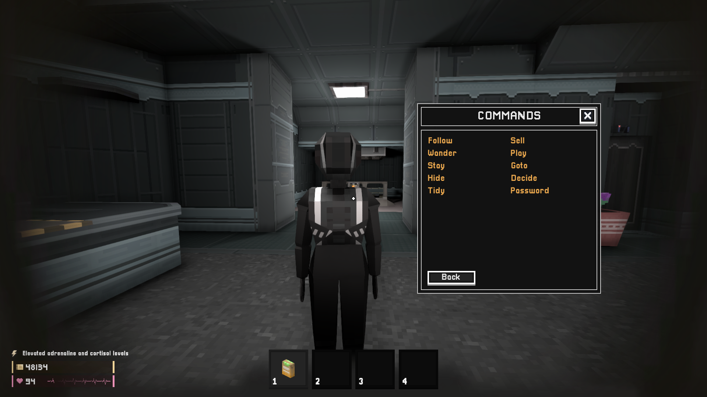
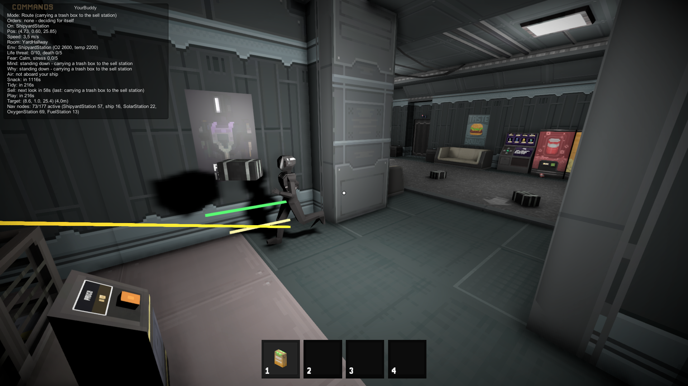
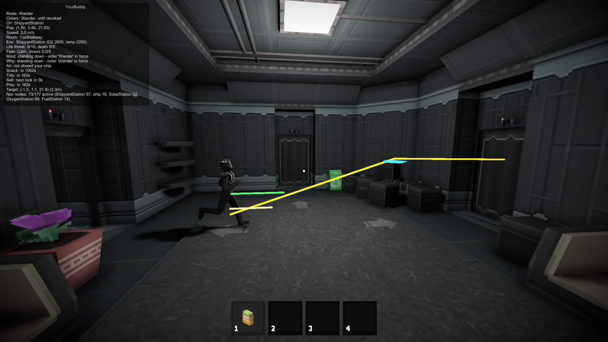
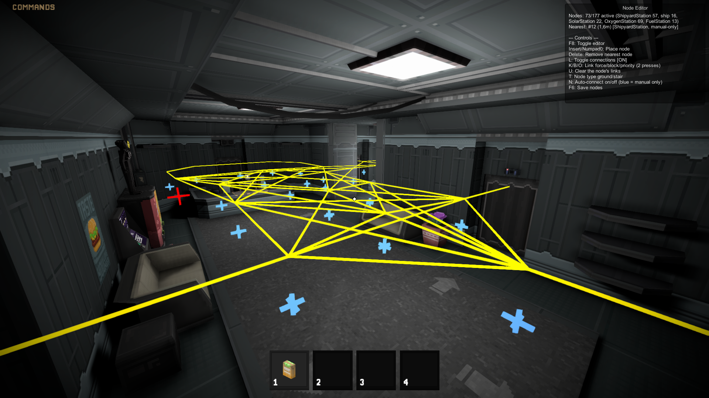

# YourBuddy Mod

A BepInEx 5 plugin that adds a player-like NPC companion to Isolated Inhale - a fun stand-in for the
multiplayer the game does not have.

In theory it should make you less anxious. In practice, after a long time alone, someone always nearby is a
bit unnerving. Try it yourself.

> ⚠️ **Disclaimer**: the game is single-player by design, and this mod may break immersion. Best played after
> you finish the story.

---

## Features

- **A companion** with the player's model. A new game starts with it asleep in the cryo capsule next to
  yours; in an existing save, `buddy_spawn` brings one in (or several: `buddy_spawn 3`).
- **Orders.** Look at it and press Interact: follow, wander, stay, go to a room, hide, tidy up, sell, play,
  or decide for itself. It also learns door PIN codes you give it.
- **Its own mind.** With no order, it picks something worth doing: switches dead life support back on, has
  a snack, tidies rubbish, sells trash boxes for you, plays with loose objects, wanders or keeps you company.
- **Space suits.** It can wear a spare suit, go outside with you and come back in.
- **Fear.** It watches the Breathless, keeps away from it, and runs or hides in a closet.
- **Anomalies.** Now and then the buddy is not quite itself, and you start to wonder whether it is still the
  friend you woke up with. What it does, and when, is left for you to find out. Nothing it does happens twice
  in a save. Harmless difficulty has none; Normal and Expert grow darker as the story goes on.
- **Mortal.** Deadly air or the Breathless can kill it; the body is a ragdoll you can carry.
- **Navigation** on a bundled nav graph for the ship and every station, with doors, stairs and an in-game
  node editor.
- **Saves** go to a `.buddy` file next to your save, so removing the mod leaves the save untouched.

---

## Installation

1. Install **[BepInEx 5](https://github.com/BepInEx/BepInEx/releases)** (Windows x64,
   `BepInEx_win_x64_5.x.x.zip`), extracted next to `Isolated Inhale.exe`.
2. Download `YourBuddy.dll` from [Releases](https://github.com/bytenull1/yourbuddy-inhl/releases) and
   `NPC.Core.dll` from [NPC.Core's releases](https://github.com/bytenull1/npc-core-inhl/releases) - the shared
   NPC library the buddy walks with.
3. Put both into `BepInEx/plugins/` and launch the game.

> To see the log while playing, set `Enabled = true` under `[Logging.Console]` in `BepInEx/config/BepInEx.cfg`.

---

## Usage

**Spawning.** A new game gives you a buddy that wakes a few seconds after you step out of your pod. In an
existing save, open the console (`~`) and type `buddy_spawn`. Running it again replaces the buddy.

**Talking.** Walk up, look at it and press **Interact**. Type an order or pick one from the list; **Escape**
closes the window. Wording is matched loosely: "follow me" and "wait here" work too.

Orders, its own decisions, several buddies, doors

| Order | What it does |
|---|---|
| `follow` | Follows you. |
| `wander` | Walks between nav nodes, doing its own thing. |
| `stay` | Holds position. It still steps aside if it is blocking a door. |
| `goto library` | Walks to a room of the docked station, by the name the debug HUD shows. `goto` alone (or the **Goto** button) lists them. |
| `decide for yourself` | Cancels your order and lets it choose again. |
| `hide` | Gets into a closet or locker and stays there until you say something else - another order, or "decide for yourself". |
| `tidy up` | Clears the rubbish nearby into a trash can, several pieces in a row. |
| `sell` | Takes every trash box nearby to a sell station and sells them in one press. |
| `play` | Goes and messes about with something loose. |
| `password 1423` | Remembers a door PIN code. A bare number works too. |

**Orders and its own mind.** With no order in force - which is how it starts, and how it comes back after loading a save - the buddy decides for itself every few seconds. It scores everything it might do: switching the life support back on (which always wins), selling trash boxes, tidying up, a snack, messing about with something, wandering off, or coming back to you. Each score is made of how overdue the thing is, how much of it there is, and how far away - so distance makes something *less* attractive rather than invisible, and it will cross a room or two for the only job going. Then it picks between the best few **at random**, which is why it does not repeat itself.

The first five words above are orders; `hide`, `tidy up`, `sell` and `play` just start that job now. An order holds until you give another one or tell it to decide for itself; with `OrderPersistence = Expires` it also runs out, and a `goto` ends when the buddy arrives. An order given while it is running from the Breathless is carried out once it has got away. `Autonomy = false` turns its own decisions off.

**Doors.** The buddy only uses codes you gave it, and only on keypads whose own code matches; the window tells you straight away whether a code opens any door it knows about. Codes are saved with your game. It plans a route around doors it cannot open, and if there is no other way, it waits for you.

**Several buddies.** `buddy_spawn 3` replaces your buddies with three in a row: Buddy, Buddy 2 and Buddy 3.
A save keeps all of them. They share the door codes you give and never go for the same box, cupboard, sell
station or closet. In the window, the one you look at most directly answers; add "everyone" to talk to all:
"everyone follow me". In the console, `@2`, `@buddy2` or `@all` picks who a command goes to; without one it
goes to the buddy you last talked to or named.

The nav graph and node editor

Wandering and long walks follow a node graph. **NPC.Core ships one for the ship and every station**, so
there is nothing to set up. To edit it, press `F8` in game - the editor, its keys and where your own graph is
saved (`BepInEx/config/NPC.Core/nodegraph.json`) are described in
[NPC.Core's README](https://github.com/bytenull1/npc-core-inhl#the-node-editor). A graph you edited under an
older YourBuddy is carried over on first start.

To make the buddy use a staircase, put a Stair node (`T`) on the bottom and top landings and link them
(`K`); check with `L` that the connection is there.

---

## Configuration

Settings live in `BepInEx/config/com.bytenull1.yourbuddy.cfg`, sections `General` and `Anomalies`. The debug
level, the bundled nav graph and the node editor keys belong to NPC.Core, in `com.bytenull1.npccore.cfg`
([its README](https://github.com/bytenull1/npc-core-inhl#configuration)).

Show all settings

| Setting | Section | Default | Description |
|-----------------------|-----------|---------|-------------|
| `SaveSupport` | General | `true` | Writes/reads the buddy's location to a sidecar `.buddy` file next to your save. |
| `SpawnOnNewGame` | General | `true` | A new game starts with a buddy: it sleeps in a cryo capsule next to yours and wakes after you step out, or stands in the Shipyard's hallway if no capsule can be opened. |
| `WakeAfterPodOpenSeconds` | General | `10` | How long that buddy keeps sleeping after your own pod starts opening. |
| `MortalNPC` | General | `true` | Allows the buddy to die (ragdoll) from deadly conditions. |
| `PreventSpace` | General | `true` | Prevents the buddy from opening airlocks, walking into open space, and teleports it back inside if it ends up there anyway. |
| `AutoDoors` | General | `true` | Allows the buddy to open room doors (Gate type) in front of it. |
| `Dialog` | General | `true` | Look at the buddy and press Interact to open the order window (follow, do its own thing, stay, hide, tidy up, sell, play, get a snack, walk to a node, give it a door password). |
| `Fear` | General | `true` | The buddy reacts to the Breathless: watches it, keeps away from it, runs from it or hides. Off: it ignores the monster (which can still kill it). |
| `HideInClosets` | General | `true` | A frightened buddy may get into a closet or locker instead of running, shut the doors, and wait there until the Breathless is no longer about. It never uses one you are in. |
| `FleeHideBias` | General | `0.5` | How readily it hides rather than runs: `0` never, `1` always try. The chance drops while the Breathless can see it - it would watch the buddy climb in - or is too close to beat to the doors, and rises when there is nowhere to run to. |
| `Autonomy` | General | `true` | The buddy decides for itself whenever no order is in force. Off: it only ever does what it was last told. Also `buddy_manage auto`. |
| `OrderPersistence` | General | `UntilRevoked` | `UntilRevoked`: an order holds until you give another one or tell it to decide for itself. `Expires`: it decides for itself again after `OrderExpirySeconds`. A goto always runs to completion. |
| `OrderExpirySeconds` | General | `90` | How long an order holds under `Expires`. |
| `Terminals` | General | `true` | When oxygen runs low or it gets too cold or hot aboard and the oxygen generator or climate control is off, a buddy walks over and switches it on - deciding for itself, and even under an order, since deadly air outranks one. When no unit can be switched on, it puts a spare suit on instead (`EvaSuit`). |
| `EvaSuit` | General | `true` | The buddy can wear a spare isolated space suit (never your only one). Ordered outside, it walks into the docked station's exit airlock and waits for you to cycle it; ordered inside, it comes back the same way. It also suits up by itself when the air aboard turns deadly and no terminal can fix it, and carries a suit you forgot on the station back to the ship (`SuitFetch`). |
| `SuitFetch` | General | `true` | While docked, a buddy aboard fetches a space suit you left lying on the station and sets it down inside your ship's airlock, until two suits are yours or aboard. Needs `EvaSuit`. `buddy_order fetchsuit` starts a fetch now. |
| `Snacks` | General | `true` | Now and then a buddy deciding for itself eats or drinks something nearby: from a container with food in it, or lying about. Never while you are hungry. `buddy_order snack` triggers one now. |
| `SnackIntervalMinutes` | General | `13` | Roughly how many minutes pass between snacks (25% more or less each time) - tracks how often the player's own satiety needs topping up. |
| `Tidying` | General | `true` | Now and then a buddy deciding for itself clears the rubbish: two to five pieces in a row, loose or out of a cupboard it closes again, into a trash can. `buddy_order tidy` starts a round now. |
| `TidyIntervalMinutes` | General | `5` | Roughly how many minutes pass between tidying rounds (25% more or less each time). |
| `SellTrash` | General | `true` | When trash boxes have piled up and a sell station is in reach, the buddy carries every one it can to the station, loads them and presses the button once - the money is yours. It only presses when nothing else sellable is in there and nobody is standing inside. `buddy_order sell` starts a run now. |
| `ItemPlay` | General | `true` | Now and then, with nothing better to do, the buddy plays with something loose: carries it across the room, takes it into another room, or throws it about and fetches it back. One to three games in a row. `buddy_order play` starts a session now. |
| `ItemPlayAnything` | General | `false` | What it may play with. Off: rubbish only. On: any loose object, your tools, food and cells included, which it will throw about like anything else. |
| `ItemPlayIntervalMinutes` | General | `5` | Roughly how many minutes pass between play sessions (25% more or less each time). |
| `DebugVisuals` | General | `false` | Draws navigation probes, target markers, and path lines. |
| `ShowHud` | General | `false` | Displays an on‑screen status panel (mode, orders, position, room, environment, fear, mind, errand timers, target); hidden while the console is open. |
| `MoveSpeed` | General | `3.5` | Default movement speed in m/s. |
| `Anomalies` | Anomalies | `true` | Now and then the buddy does something strange or frightening. How far it goes follows `AnomalyDifficulty` and your story progress. `buddy_anomaly` lists them and starts one now. |
| `AnomalyDifficulty` | Anomalies | `Game` | `Game` follows the game's difficulty; `Harmless` (none), `Normal` or `Expert` sets it for the buddy alone. |
| `AnomalyFrequency` | Anomalies | `1` | Multiplies how often they happen. `0`: never by themselves. |

---

## Console Commands Reference

Type `buddy` in the console for the list.

Show all console commands

Type `buddy` in the console for this list, grouped. Spawning, despawning and killing are commands of
their own:

| Command | Arguments | Description |
|------------|-----------|-------------|
| `buddy_spawn` | `[number]` | Replaces every buddy with one in front of you, or with that many in a row. |
| `buddy_despawn` | `[@who]` | Despawns a buddy. |
| `buddy_kill` | `[force] [@who]` | Kills a buddy (ragdoll), with an optional forward impulse force (0–100). |

Everything else is grouped: each category is one command, and the first word after it picks what to do:
`buddy_order follow @2`. A category alone lists its subcommands.

**`buddy_manage`** - list and set up buddies

| Subcommand | Arguments | Description |
|------------|-----------|-------------|
| `list` | – | Lists the buddies with their numbers and names; `*` marks the one commands go to. |
| `skin` | `<name\|default> [@who]` | Debug: put `skins/<name>.png` (next to the plugin dll) on the buddy's body, or `default` to restore. With no name it lists the skins. |
| `auto` | `[on\|off]` | Let the buddy decide for itself (`on` also cancels the order in force), or stop it deciding. Saved in the config. |

**`buddy_order`** - tell a buddy what to do (the dialog gives the same orders)

| Subcommand | Arguments | Description |
|------------|-----------|-------------|
| `follow` | `[@who]` | Switch to follow mode. |
| `stop` | `[@who]` | Stop current route/wander and follow. |
| `wander` | `[@who]` | Switch to wander mode (uses nav nodes as points of interest). |
| `stay` | `[@who]` | Hold position until told otherwise. |
| `snack` | `[@who]` | Make the buddy get a snack nearby right now (ignores the schedule and the `Snacks` setting). |
| `tidy` | `[@who]` | Make it clear the rubbish nearby into a trash can right now, several pieces in a row. |
| `sell` | `[@who]` | Make it take every trash box nearby to a sell station and sell them in one press. |
| `play` | `[@who]` | Make it go and mess about with something loose right now. |
| `hide` | `[@who]` | Make it get into a closet or locker now, whatever it is feeling. It stays in there **until you give it another order** - no timer, and the Breathless leaving does not bring it out. |
| `outside` | `[@who]` | Send the buddy outside: it puts a spare suit on (never your only one), walks into an airlock (a station's, or the ship's own while undocked) and waits for you to cycle it. On the FuelStation's surface it walks; out of the other airlocks it floats and flies after you. An EVA skin is drawn while it wears the suit. |
| `inside` | `[@who]` | Bring the buddy back in from outside: it walks, or flies, into the airlock you stand in (else the nearest) and waits for you to cycle it. Back inside in breathable air, it takes the suit off by itself. |
| `suit` | `<on\|off> [@who]` | Make the buddy put a spare suit on, or take the worn one off, right now. It keeps the suit on outside and in an airlock. |
| `fetchsuit` | `[@who]` | Make the buddy fetch a suit you left on the docked station right now, even with `SuitFetch` off. Says why when there is none to fetch. |
| `terminal` | `<oxygen\|climate> [@who]` | Make the buddy switch that unit on now, whatever the air (for testing; only if it is off and not broken or faulted). |
| `password` | `<code>` | Tell the buddies a door PIN code - all of them learn it. It is used only on keypads whose own code matches, and is saved with your game. |

**`buddy_anomaly`** `[<kind>|end|roll|list|forget] [@who]` - with no argument, the current state and what this save has had; `list` names every kind and whether it can come now; a kind starts it now (it still says why when it does not fit); `end` stops the running one; `roll` draws one as the mod would; `forget` lets this save have every one again.

**`buddy_dev`** - testing and debugging

| Subcommand | Arguments | Description |
|------------|-----------|-------------|
| `goto` | `<node_index> [@who]` | Walk the buddy to a specific nav-graph node (the dialog takes room names instead). |
| `speed` | `<value> [@who]` | Set movement speed (0.5–10 m/s). |
| `mind` | `[@who]` | Show what the buddy is weighing and when it acts next (the HUD's Mind / Why / Air / Snack / Tidy / Sell / Play / Fetch suit lines). |
| `bout` | `[@who]` | End the current follow or wander stretch now, so the other one weighs full at its next decision (for testing). |
| `visuals` | `[on/off]` | Toggle debug visuals (path, probes, target markers). |
| `hud` | `[on/off]` | Toggle status HUD. It shows the buddy commands go to. |

**NPC.Core's** ([its commands](https://github.com/bytenull1/npc-core-inhl#console-commands)): `npc_node`, `npc_gates`,
`node_editor`, `debug_level`, and:

| Command | Arguments | Description |
|---------|-----------|-------------|
| `ai_disable` | `[buddy\|monster\|all] [on\|off]` | NPC.Core's. Debug: freeze the buddies' AI (every NPC mod's), the Breathless's, or both. Nothing is written to your save, so a reload always clears it. |
| `ai_notarget` | `[on\|off]` | NPC.Core's. Debug: the Breathless stops noticing **you** - it keeps wandering, and it still hunts the buddy. |

---

## Known Issues / Limitations

- The buddy can still get stuck now and then.
- It goes into space only with you, in a spare suit: the game's airlocks cycle only for the player.
- Doors sometimes stay open behind it.
- Room names in the HUD are unreliable (often `Front_M00` for most of the ship): the game has no room volumes.
  Cosmetic only.

Found a bug? Report it on the [issue tracker](https://github.com/bytenull1/yourbuddy-inhl/issues) or the
mod's discussion thread. Pull requests are welcome: see [CONTRIBUTING.md](CONTRIBUTING.md). Technical docs
are in [docs/](docs/README.md).

---

## When will the mod be updated?

- If major updates break something important (tested on version v0.8.9).
- If the map changes (AI node updates, such as when ObservingStation is released).
- If enemy behavior changes or new enemies are added (aggro on the NPC).
- If the AI needs improvement (the main focus is on navigation, the set of supported actions, and behavior).

---

## Building from Source

Show build steps

The project is an SDK-style class library targeting **.NET Standard 2.1**, so no Visual Studio project system or `.NET Framework` targeting pack is required - the .NET SDK is enough to build it.

1. **Install required tools**
   - [.NET SDK](https://dotnet.microsoft.com/en-us/download) (a recent version)
   - Optional: **Visual Studio**, **Rider**, or **Visual Studio Code** with the C# extension.

2. **Clone the repository** (or extract the source archive).

3. **Provide the reference assemblies**
   Copy the DLLs the project compiles against out of your own game install into
   `YourBuddy/lib/`. The list and where each one comes from is in
   [`YourBuddy/lib/README.md`](YourBuddy/lib/README.md). They are not redistributed
   here and are not copied into the build output.
   YourBuddy builds on [NPC.Core](https://github.com/bytenull1/npc-core-inhl): clone it beside this repository
   (`../npc-core-inhl`) and it is built with YourBuddy, or copy its `NPC.Core.dll` into `YourBuddy/lib/`.

4. **Build the project**
   - From the command line, in the repository root: `dotnet build YourBuddy/YourBuddy.csproj -c Release`
   - In Visual Studio / Rider: open `YourBuddy.slnx` and build the `Release` configuration.
   - There is no framework/toolset mismatch to worry about - `netstandard2.1` builds the same way on any platform with the .NET SDK installed.

5. **Output file**
   After a successful build, `YourBuddy.dll` will appear in `YourBuddy/bin/Release/netstandard2.1/`. Copy it to `BepInEx/plugins/` in your game directory, together with `NPC.Core.dll`, and launch the game.

---

## Development Notes

Show development notes

Navigation - the plugin's biggest headache.

Isolated Inhale has no NavMesh, AI nodes, or any NPC navigation (that's why Breathless moves like an amoeba). I had to build the navigation code from scratch, and it turned out harder than expected.

The approach went through several iterations: raycast-based steering and auto‑door detection, pre‑recorded routes, auto-generated nodes, and a failed NavMesh attempt. Finally, I settled on an improved node‑based solution with debugging, manual editing, and better route planning.

Then came endless bug fixes: strict checks broke valid paths, relaxing them introduced line-of-sight (LOS) errors, fixing LOS triggered new edge cases - and the cycle repeated. This is probably the best I can do.

> ⚠️ **Before touching this code, read this**: The navigation/pathfinding system is cursed. If you want to make any changes there, you'd better have a PhD in mathematics. It's difficult to debug, involves many magic constants, and carries a high risk of regression. Known AI regression hot spots: stairs, elevated railings, long sections, the spacecraft‑station airlock, and the spacecraft itself.

---

## Showcase

[Watch the showcase on YouTube](https://www.youtube.com/watch?v=zlu82lW7UME)

